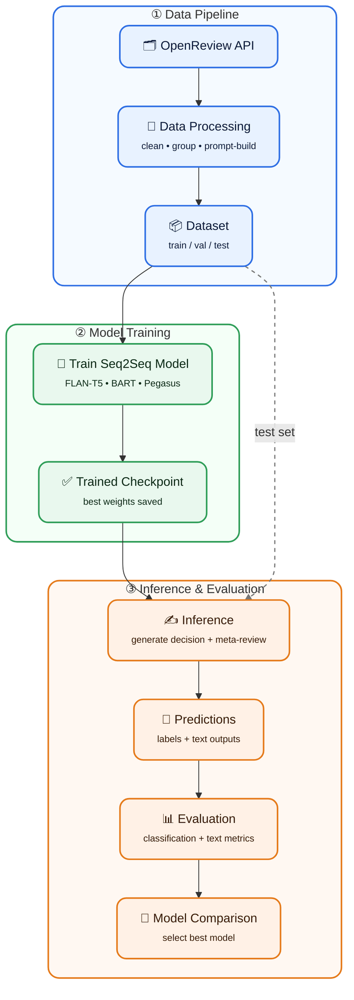

# Meta-Review AI

Automated generation of ICLR meta-reviews and accept/reject decisions using fine-tuned seq2seq models.

Given a paper's reviews (ratings, strengths, weaknesses, summaries, questions), the model produces a meta-review and a final decision — mimicking what an Area Chair would write.

## Dataset

**Source:** ICLR 2025 official reviews scraped from the [OpenReview API](https://openreview.net/).

| Split | Papers |
|-------|--------|
| Train | 6,890  |
| Val   | 862    |
| Test  | 862    |
| **Total** | **8,614** |

Label distribution: 57% Reject / 43% Accept.

Raw data: [Google Drive](https://drive.google.com/file/d/16M1sQygtZo7zKGpfb5b81FUx2mTRRD4Y/view?usp=sharing)

See [DATADICTIONARY_README.md](DATADICTIONARY_README.md) for column descriptions.

## Models

| Run | Model | Config | Status |
|-----|-------|--------|--------|
| run1 | `google/flan-t5-base` | `configs/run1_finetune.yaml` | Done |
| run2 | `facebook/bart-large-cnn` | `configs/run2_bart.yaml` | Done |
| run3 | `google/pegasus-large` | Notebook only | Done |

All models are fine-tuned with **LoRA** (via PEFT) for parameter-efficient training.

## Architecture



## Project Structure

```
meta-review-ai/
├── configs/                        # YAML training configs per model
├── data/
│   ├── raw/                        # Raw review CSV (not tracked)
│   ├── processed/                  # Train/val/test JSONL (not tracked)
│   └── predictions/                # Model predictions CSV
├── src/
│   ├── preprocessing/
│   │   └── build_dataset.py        # CSV → structured JSONL (one row per paper)
│   ├── OpenReviewDataExtract.py    # Scrape ICLR reviews from OpenReview API
│   ├── train_flan_t5.py            # Fine-tune any seq2seq model with LoRA
│   ├── generate_predictions.py     # Run inference on test set
│   ├── train_bart_colab.ipynb      # BART training (Colab)
│   ├── pegasus-large_lora_train_and_generate.ipynb
│   ├── pegasus-x-base_train_and_generate.ipynb
│   ├── demo_app.py                 # Streamlit demo (Pegasus, requires checkpoint)
│   ├── demo_csv.py                 # Streamlit demo (CSV only, no model)
│   └── eval_flan_t5.py             # Evaluation metrics (TODO)
├── runs/                           # Saved model checkpoints (not tracked)
├── requirements.txt
└── DATADICTIONARY_README.md
```

## Setup

```bash
pip install -r requirements.txt
```

## Usage

### 1. Data Collection (optional — raw CSV already available)

```bash
python src/OpenReviewDataExtract.py
```

### 2. Preprocessing

Converts the review-level CSV into paper-level JSONL with structured prompts and train/val/test splits.

```bash
python src/preprocessing/build_dataset.py --csv_path data/raw/iclr_2025_detailed_reviews.csv
```

### 3. Training

Pass a config file to select which model to train:

```bash
# FLAN-T5-base
python src/train_flan_t5.py --config configs/run1_finetune.yaml

# BART-large-CNN
python src/train_flan_t5.py --config configs/run2_bart.yaml
```

### 4. Generate Predictions

```bash
python src/generate_predictions.py --model_path runs/flan_t5_run1
python src/generate_predictions.py --model_path runs/bart_large_cnn_run2
python src/generate_predictions.py --model_path pegasus_large_lora   # if trained via notebook
```

### 5. Demo (Streamlit)

**Option A — With model** (interactive generation):
```bash
pip install streamlit
streamlit run src/demo_app.py
```
Place your trained Pegasus checkpoint at `pegasus_large_lora/` (or set path in sidebar).

**Option B — CSV only** (no model, no training):
```bash
streamlit run src/demo_csv.py
```
Browse pre-computed predictions from `pegasus_x_meta_review_predictions.csv`. No checkpoint required.

## Input/Output Format

**Input** (structured prompt per paper):
```
TASK:
Write an ICLR meta-review based on the paper and reviewer feedback.
Also output a final decision.

PAPER TITLE: ...
ABSTRACT: ...
AGGREGATES:
- NumReviews: 4
- MeanRating: 5.25
- RatingRange: 3 to 8

REVIEWS:
REVIEW 1:
FinalRating: 3
Summary: ...
Strengths: ...
Weaknesses: ...
```

**Output** (model target):
```
DECISION: REJECT
META_REVIEW:
The paper proposes ... however reviewers raised concerns about ...
```

## Requirements

- Python 3.10+
- PyTorch
- Transformers, PEFT, Datasets (HuggingFace)
- See `requirements.txt` for full list
